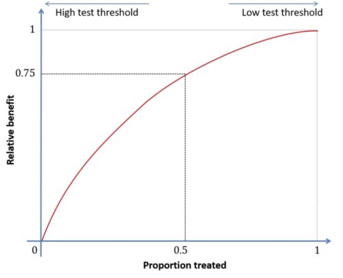
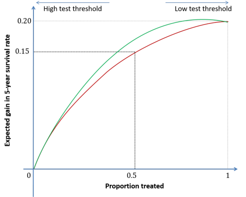

```{r setup, include = FALSE}
knitr::opts_chunk$set(
  collapse = TRUE,
  comment = "#>",
  fig.width=6, fig.height=4
)
```
Relative Impact Characteristic (RIC) curve is a novel graphical tool that visualizes the power of a marker (e.g., a biomarker or a risk prediction score) in terms of its capacity towards 'concentration of benefit' from subsequent therapies. 

RIC depicts the trade-off between the population-level impact of a treatment (Y-axis) as a function of the size of the treated population (X-axis) for a given marker threshold. 

Interpretations of shape, area under curve and slope in RIC curve are analogous to the widely used Receiver Operating Characteristic (ROC) curve, making it easier to use by the research community. For example: both curves span from (0,0) to (1,1), and the better the marker, the more concave the curves. 

The following sections outline basic characteristics of the RIC curve and provide an example that illustrates its use. For a more comphrenesive discussion and a case study, please refer to the original research paper entitled *Relative Impact Characteristic (RIC) curve: a graphical tool to visualize and quantify the clinical utility and population-level consequences of implementing markers* ^[Mohsen Sadatsafavi, Paul Gustafson, Zafar Zafari, and Don D. Sin, **Relative Impact Characteristic (RIC) curve: a graphical tool to visualize and quantify the clinical utility and population-level consequences of implementing markers**, *Annals of Epidemiology*]  

## Definition of the RIC Curve

Imagine a clinical scenario in which a clinican has to decide whether to prescribe radiotherapy to prevent relapse in cancer patients who have been successfully treated and are currently cancer-free. If the patient is susceptible to relapse, radiotherapy might prevent that at the expense of the cost and potential side-effects. However, if the patient is not susceptible to relapse, radiotherapy not only is costly, but also could be harmful due to its side-effects. For these reasons, the goal is to limit radiotherapy to those patients who are *more likely* to benefit from it. 

For certain diseases, there are biomarkers (i.e. a blood test) or risk scores (i.e. the Framingham Risk Score) that can estimate whether the patient is susceptible to a certain outcome or not. A threshold value of the markers can then be used to decide the course of action, in this case whether to provide the treatment or not. 

In developing these markers, researchers often have many candidates to choose from. While the ROC curve compares the diagnostic ability of such markers, the RIC curve allows visual comparison of markers based on their abiltiy to concentrate the benefit. 

In its most basic use case, the RIC curve can be drawn for a single disease marker or a risk prediction score. The marker is assumed to have a continuous value, and to be used for a binary treatment decision. We assume that patients with marker values higher than a threshold value $x$ are to recieve the treatment.  

The horizontal axis of the plot, $p$, is defined as the proportion of the population that receives the treatment. Note that $p$ is a function of the marker threshold value $x$:  

$p(x) = \int_x^{+\infty} f(y) dy$

where $f$ is the probability distribution of the marker value in the population.

The vertical axis of the plot is "the relative impact" and is denoted by $q$. Relative impace is defined as the expected effect of treatment in individuals who receive the treatment divided by the expected effect in all patients. 

In mathematical terms,

$q(x) = \int _x ^{+\infty} b(y)f(y)dy/ \bar{b}$, 

where $b(x)$ is the expected treatment effect and $\bar{q}$ is the average treatment effect when provided to all: 

$\bar{b} = \int _x ^{+\infty} b(y)f(y)dy$.

The RIC curve is the plot of $p(x)$ against $q(x)$ as $x$ varies. 




## Similarities with the Receiver Operating Characteristic (ROC) Curve

Similar to the widely used ROC curve, RIC has interpretable shape, area under the curve, and slope.

### Shape of the RIC curve

Similar to the ROC curve, the non-informative marker on the RIC curve for a clinical
outcome corresponds to a line connecting points (0,0) and (1,1). The more concave the curve, the better the marker. 

An illustrative example would make this more clear. Assume there are two candidate markers (green and red) that can be used to decide whether or not to provide the treatment. In the RIC plot below the marker that corresponds to the green line provides better concentration of benefits at any given level of $q$. For instance, if we choose threshold values that lead to half of patients receiving the treatment, the green marker will provide more benefit. 



### Area Under the Curve

The area under the RIC curve $(AUC_I)$ can be used to compare, independently of any threshold, different combination of tests to inform a treatment decision. If two individuals are selected at random, the $(AUC_I)$ is the relative impact of the decision to provide the treatment only to the individual with a higher marker value, compared with providing the treatment to both.


### Slopes of the RIC curve

If the treatment effect is characterized as the change in the risk or rate of an event, the slopes on the RIC curve can be used to find thresholds based on minimal acceptable risk reduction provided by treatment, or the corresponding maximal acceptable number-needed-to-treat, as will be explained in the case study.

## Example with Simulated Data

A simulated dataset called `reg_data` is included in the package. The dataset pertains to a simulated randomized clnical trial in which patients are randomized to either placebo or treatment and are followed for up to one year. The outcome of interest is the number of disease flair-ups (exacerbations) during follow up.

For each individual, the dataset contains the marker value (x), three covariates (c1-c3), a treatment assignment indicator (tx), log of follow-up time (ln_time), and number of events (events). The first few data rows are provided below:

```{r, echo=FALSE}
library(RIC)
#summary(reg_data)
tab <- head(reg_data)
knitr::kable(tab)
```

```{r, echo=TRUE, results='asis'}
library(RIC)
#Is called by the main code (below) to calculate RIC metrics using different methods
ric=function(marker_formula=events~tx+c1+c2+c3+offset(ln_time),q_formula=events~tx+c1+c2+c3+offset(ln_time),sample_size=1000)
{
  message("legend:\n dark line: empirical RIC\n grey line: parameteric approximation of RIC\n emp: empirical \n mfc: method of forced choice: simulating pairs of subjects and a=giving treatment to the one with higher marker value, b=giving both treatment, c) calculating the average benefit of a over b.\n parm: parametric approximation)")
  pred_data<-reg_data
  pred_data[,'ln_time']<-0
  #G-computation
  reg_object<-MASS::glm.nb(data=reg_data,formula=q_formula,link=log)
  res<-ric_regression(reg_object,pred_data)
  plot(res$pq[,1],res$pq[,2],type='l',xlab="Proportion treated",ylab="Relative benefit",xlim=c(0,1),ylim=c(0,1))
  text(0.7,0.3,paste("AUCi (emp):",round(res$auci,3)))
  #Parametric RIC (Appendix II) based on estimated mean and covariance matrix of (x,b).
  xb_data<-res$xb_data
  xb_data[,2]<-log(xb_data[,2])
  temp<-ric_parametric(p_x=(0:100)/100,mu_x =mean(xb_data[,1]),sd_x = sd(xb_data[,1]), mu_b = mean(xb_data[,2]), sd_b = sd(xb_data[,2]),rho = cor(xb_data)[1,2],type = "lognormal")
  lines(temp$p_x,temp$q_x,lty=6,col='grey')
  text(0.7,0.2,paste("AUCi (parm):",round(temp$auci,3)))
  #Simulating the method of forced choice: creating pairs of subjects and a=giving treatment to the one with higher marker value, b=giving both treatment, c) calculating the average benefit of a over b
  #see auci_mfc() for details
  text(0.7,0.1,paste("AUCi (mfc):",round(auci_mfc(res$xb),3)))
}

#Main code

#Complete score (includes all covariates)
ric(marker_formula=events~tx+c1+c2+c3+offset(ln_time))


```
